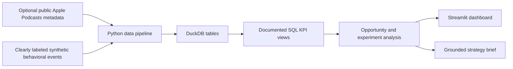

# Signal: Podcast & Video Analytics Intelligence Platform

> Which podcast and video content opportunities should Spotify prioritize, and how should their incremental impact be measured?

Signal is a decision-oriented analytics portfolio project built for a Podcast & Video Data Scientist role. It combines a reproducible SQL KPI layer, content opportunity analysis, randomized experiment measurement, an interactive Streamlit dashboard, and a grounded strategy-brief workflow.


## Executive Findings

Using the reproducible demonstration dataset:

- **Comedy, Health & Fitness, and Technology** rank as the top three content opportunities based on growth, engagement intensity, and audience scale.
- Video represents **48.4% of content starts**, indicating that format strategy should be evaluated alongside category strategy.
- The simulated randomized video-clips promotion increased full-episode discovery by **3.08 percentage points** or **19.7% relative**, with a 95% confidence interval of **2.12 to 4.03 points**.
- The treatment also improved completion and listening minutes, supporting a **measured rollout** with continued guardrail monitoring.
- Brazil produced the strongest segment-level discovery effect. Great Britain's interval crosses zero, demonstrating why segment uncertainty must be reviewed before rollout decisions.

See the full [stakeholder strategy memo](docs/strategy_memo.md).

## Product Walkthrough

The dashboard contains four decision-focused views:

1. **Executive Overview** — headline KPIs, consumption momentum, opportunity map, and prioritized investments.
2. **Opportunity Explorer** — market/category demand, format and duration effects, and creator health.
3. **Experiment Measurement** — sample sizing, treatment lift, confidence intervals, segment effects, and rollout decision.
4. **AI Strategy Brief** — a grounded narrative generated only from computed dashboard metrics, with claim-level evidence IDs and a downloadable evidence register.

The global filters update market, category, format, and date analyses consistently.

## Run Locally

```bash
python3 -m pip install -r requirements.txt
python3 -m src.data_pipeline
streamlit run app.py
```

The database is generated automatically on first app launch if it does not exist.

Run validation:

```bash
python3 -m pytest -q
```

Deployment instructions are available in [`docs/deployment.md`](docs/deployment.md).

## Architecture



Core tables:

- `content`: category, creator, format, duration, release date, and market
- `creators`: cadence, audience size, retention, and growth
- `engagement`: daily impressions, starts, completions, minutes, audience, and repeat consumption
- `experiment`: randomized assignment and pre/post outcomes

The SQL KPI layer in [`sql/metrics.sql`](sql/metrics.sql) defines content, creator, and daily performance views.

## Measurement Framework

**Experiment question:** Does promoting video podcast clips increase full-episode discovery and completion?

| Role | Metric |
| --- | --- |
| Primary | Full-episode discovery rate |
| Secondary | Completion rate |
| Guardrail | Listening minutes per active user |
| Decision rule | Ship when primary lift is positive and its 95% CI excludes zero, with no guardrail degradation |

Power analysis targets 80% power with a two-sided 5% significance threshold. Treatment assignment is balanced and reproducible with a fixed seed.

## Grounded Insight Generation

The strategy brief is generated from filtered KPI and experiment frames. Quantitative claims are formatted directly from computed values and include stable evidence IDs such as `EXP-PRIMARY` and `KPI-HOURS`. Stakeholders can inspect or download the claim-to-metric evidence register from the dashboard.

This deterministic grounding layer can safely be passed to an LLM for tone or structure refinement while preventing the model from creating new metrics. The default application remains fully functional without an API key.

## Data Disclosure

Spotify user-level data is not publicly available. Behavioral engagement and experiment events in this project are synthetic and explicitly labeled. They are designed to demonstrate analytical methodology, not represent Spotify performance.

The pipeline also includes an optional Apple Search API metadata fetcher for public podcast catalog enrichment. The application does not depend on network access and defaults to a fully reproducible synthetic catalog. See [`data/README.md`](data/README.md) for details.

## Repository Structure

```text
app.py                  Streamlit application
src/data_pipeline.py    Data generation and optional public metadata fetch
src/analytics.py        KPI, opportunity, and experiment analysis
src/strategy.py         Grounded strategy brief generation
sql/metrics.sql         Reproducible KPI definitions
tests/                  Calculation and reproducibility tests
docs/strategy_memo.md   One-page stakeholder recommendation
docs/deployment.md      Streamlit deployment and verification guide
```

## Resume Bullets

- Built a podcast and video analytics platform using Python, SQL, DuckDB, and Streamlit to identify content investment opportunities across categories, markets, formats, and creator segments.
- Designed a randomized experimentation framework measuring incremental lift from video-podcast promotion using power analysis, confidence intervals, guardrail metrics, and segment-level effects.
- Developed grounded AI-ready strategy briefs that translated engagement KPIs into stakeholder-ready programming and product recommendations.
